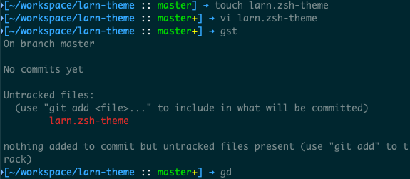

# Larn ZSH Theme

A clean and customizable oh my zsh theme with Git integration, designed for dark terminals. It features a colorful prompt with dynamic Git branch and status indicators, and distinct `ls` colors for files and directories.



## Features

- **Dynamic Prompt**:
  - **Git Repositories**: Displays `[path :: branch status] ➜`
    - Path and brackets in larn (`%F{75}`).
    - Separator `::` in white.
    - Branch name with color-coded branches:
      - `main`/`master`: Green (`%F{40}`)
      - `dev`: Yellow (`%F{226}`)
      - `feature-*`: Larn (`%F{75}`)
      - Others: Orange (`%F{214}`)
    - Git status indicators in yellow (`%F{226}`):
      - `*`: Modified or staged files
      - `+`: Untracked files
      - `!`: Merge conflicts
    - Prompt arrow (`➜`) in larn.
  - **Non-Git Directories**: Displays `[path] ➜`
    - Path and brackets in larn.
    - Prompt arrow in larn.

- **Colorful `ls` Output**:
  - Directories: Bold larn
  - Regular files: Default color
  - Executables: Red
  - Symbolic links: Cyan
  - Other file types (sockets, pipes, etc.): Distinct colors
  - Compatible with macOS (`ls -G`) and Linux (`ls --color=auto`).

- **Lightweight and Optimized**:
  - Minimal code with efficient Git status checks.
  - Clear structure for easy customization.

## Installation

1. **Clone or Copy the Theme**:
   - Save the theme file as `larn.zsh-theme` in your oh my zsh custom themes directory:
     ```bash
     cp larn.zsh-theme ~/.oh-my-zsh/themes/
     ```

2. **Set the Theme**:
   - Edit your `~/.zshrc` and set the theme:
     ```bash
     ZSH_THEME="larn"
     ```
   - Apply changes:
     ```bash
     source ~/.zshrc
     ```

3. **Verify Setup**:
   - Navigate to a Git repository and check the prompt: `[path :: branch status] ➜`.
   - Navigate to a non-Git directory and check: `[path] ➜`.
   - Run `ls -lah` to confirm colorful file and directory output.

## Requirements

- **Zsh** with **oh my zsh** installed.
- Terminal supporting **256 colors** (`echo $TERM` should output `xterm-256color` or similar).
- Optional: A font supporting emojis (e.g., [Nerd Fonts](https://www.nerdfonts.com/)) for better prompt rendering.

## Customization

- **Change Colors**:
  - Edit color variables in the theme file (e.g., `BLUE='%F{75}'` for path and arrow).
  - Use 256-color codes (e.g., `%F{69}` for darker larn, `%F{228}` for brighter yellow).
  - Test colors in your terminal to match your preferences.

- **Modify Prompt**:
  - Adjust the `PROMPT` string in `set_prompt` to change symbols or layout.
  - Example: Replace `➜` with another symbol like `→` or `$`.

- **Extend Git Status**:
  - Modify `parse_git_status` to add more Git indicators (e.g., ahead/behind remote).

- **LS Colors**:
  - Customize `LSCOLORS` (macOS) or `LS_COLORS` (Linux) for different file type colors.
  - Refer to `man dircolors` (Linux) or `man ls` (macOS) for details.

## Troubleshooting

- **Prompt not displaying correctly?**
  - Ensure `ZSH_THEME="larn"` is set in `~/.zshrc`.
  - Verify Git is installed and working (`git --version`).
  - Check if `is_git_repo` works: Run `git rev-parse --is-inside-work-tree` in a Git directory.

- **Colors not showing?**
  - Confirm your terminal supports 256 colors (`echo $TERM`).
  - Try adjusting color codes in the theme file.

- **LS colors not working?**
  - Ensure `CLICOLOR=1` (macOS) or `ls --color=auto` (Linux) is enabled.
  - Check `LSCOLORS` or `LS_COLORS` syntax.

## License

This theme is released under the [MIT License](/LICENSE). Feel free to modify and share!

## Contributing

Suggestions and pull requests are welcome! Please open an issue or submit a pull request on the repository (if hosted).

---

Happy coding with Larn ZSH Theme! 🚀 
